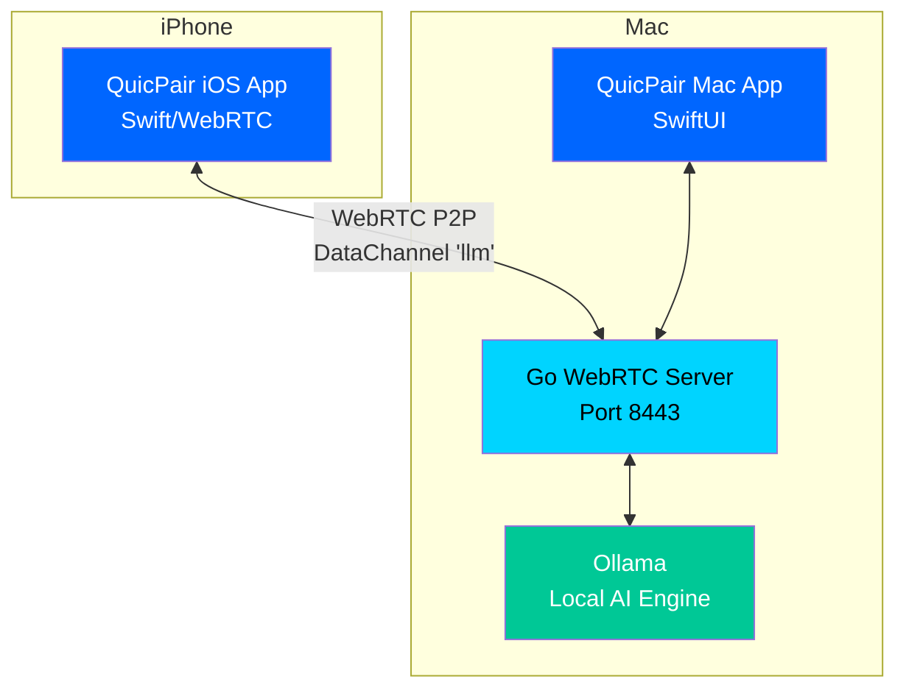

# QuicPair

<p align="center">
  
</p>

<p align="center">
  <strong>完全プライベートなAIチャット - あなたのデータは端末から出ません</strong>
</p>

<p align="center">
  <a href="https://github.com/yukihamada/QuicPair/releases"></a>
  <a href="https://github.com/yukihamada/QuicPair/blob/main/LICENSE"></a>
  <a href="https://yukihamada.github.io/QuicPair/"></a>
  <a href="https://github.com/yukihamada/QuicPair/actions"></a>
</p>

---

QuicPairは、MacとiPhone間でWebRTCを使用した直接P2P通信により、**完全にローカルなAI推論**を実現する革新的なアプリケーションです。データは一切外部に送信されず、軍用レベルの暗号化で保護されます。

## 🚀 デモ

<p align="center">
  
</p>

## ✨ 主要機能

### 🔒 **完全なプライバシー保護**
- **Private-by-Default**: データは端末から一切出ません
- **E2E暗号化**: WebRTC DTLS + Noise IK による二重暗号化
- **Strict Local Mode**: LAN/Tailscale内のみの通信（既定で有効）
- **ゼロログポリシー**: 会話内容は一切記録されません

### ⚡ **超高速レスポンス**
- **TTFT < 150ms**: 業界最速クラスの初回応答時間
- **最適化されたモデル選択**: プロンプト長に応じた自動最適化
- **事前ウォームアップ**: よく使うモデルを自動的に準備

### 🧠 **豊富なAIモデル**
- **最新2025年モデル**: Qwen3シリーズ、GPT-OSS、Jan-Nano
- **30以上のモデル**: 用途に応じて選択可能
- **自動インストール**: Ollamaを自動でセットアップ

### 📱 **シームレスな連携**
- **QRコード接続**: 簡単ワンタップペアリング
- **リアルタイムチャット**: 遅延のない自然な会話
- **クロスプラットフォーム**: Mac ↔ iPhone 完全対応

## 🏗️ アーキテクチャ



## 📦 インストール

### macOS (推奨)

```bash
# Homebrewでインストール
brew install --cask quicpair

# または直接ダウンロード
curl -L https://github.com/yukihamada/QuicPair/releases/latest/download/QuicPair-macOS.dmg -o QuicPair.dmg
open QuicPair.dmg
```

### iOS

[App Store](https://apps.apple.com/app/quicpair) からダウンロード（準備中）

### ソースからビルド

```bash
# リポジトリをクローン
git clone https://github.com/yukihamada/QuicPair.git
cd QuicPair

# Go依存関係をインストール
cd server && go mod tidy

# Goサーバーを起動
go run .

# 別ターミナルでMacアプリを起動
open mac-app/QuicPair.xcodeproj
# Xcodeで実行（Cmd+R）
```

## 🎯 使い方

### 初回セットアップ

1. **Mac**: QuicPairアプリを起動
2. **自動セットアップ**: Ollamaが自動でインストールされます
3. **QRコード表示**: 接続用QRコードが表示されます
4. **iPhone**: QuicPair iOSアプリでQRコードをスキャン
5. **接続完了**: 安全なP2P接続が確立されます
6. **チャット開始**: 完全ローカルでAIと会話できます

### 利用可能なモデル

#### 無料版（Core）
| モデル | サイズ | 説明 |
|-------|--------|------|
| SmolLM2 135M | 77MB | 超軽量モデル |
| Qwen3 1.7B | 1.0GB | バランス型 |

#### Pro版（¥1,480/月）
| モデル | サイズ | 説明 |
|-------|--------|------|
| Qwen3 4B/8B/14B/32B | 2.4-18GB | 最新高性能モデル |
| Qwen3 Coder 30B | 17GB | コーディング特化 |
| GPT-OSS 20B/120B | 12-70GB | OpenAIオープンウェイト |
| Jan-Nano 32K/128K | 2.4GB | 長文対応モデル |
| その他25以上のモデル | - | Llama、Mistral、Gemma等 |

## 🔧 設定

### 環境変数

```bash
# Ollama設定
export OLLAMA_URL="http://127.0.0.1:11434"  # Ollama接続先
export OLLAMA_MODEL="qwen3:4b"              # 既定モデル

# セキュリティ設定
export DISABLE_STRICT_LOCAL="1"             # Strict Local Mode無効化（非推奨）
export DEV_ALLOW_PLAINTEXT="1"              # 開発用：平文通信許可

# TURN設定（NAT越え用）
export TURN_URLS="turn:your-server:3478"
export TURN_USER="username"
export TURN_PASS="password"
```

### パフォーマンスチューニング

```bash
# TTFT測定
curl http://localhost:8443/metrics/ttft

# レスポンス例
{
  "p50_ms": 145,
  "p90_ms": 230,
  "count": 1024
}
```

## 🧪 開発者向け

### プロジェクト構成

```
QuicPair/
├── server/              # Go WebRTCサーバー
│   ├── main.go          # メインサーバー、エンドポイント
│   ├── noise.go         # Noise IK暗号化実装
│   ├── ollama_fast.go   # 高速Ollamaクライアント
│   └── ollama_manager.go # モデル管理・最適化
├── mac-app/             # Mac SwiftUIアプリ
│   ├── Views/           # UI（ContentView、ModelSelectionView等）
│   ├── Services/        # ビジネスロジック
│   └── Models/          # データモデル
├── ios-app/             # iOS Swiftアプリ  
│   ├── Views/           # UI（ChatView、ScannerView等）
│   └── Services/        # WebRTC、暗号化管理
├── scripts/             # 開発・ビルドスクリプト
│   ├── measure_ttft.sh  # TTFT測定
│   ├── create_dmg.sh    # DMG作成
│   └── prepare_github_release.sh # リリース準備
├── docs/                # 技術仕様書
├── marketing/           # マーケティング素材
└── CLAUDE.md            # Claude Code開発ガイド
```

### 利用可能なスクリプト

```bash
# 開発・テスト
./scripts/measure_ttft.sh           # TTFT測定
./scripts/test_e2e_encryption.sh    # E2E暗号化テスト
./scripts/test_mac_iphone_p2p.sh    # P2P接続テスト

# ビルド・配布
./scripts/create_dmg.sh             # DMGインストーラー作成
./scripts/codesign.sh               # コード署名
./scripts/prepare_github_release.sh # GitHubリリース準備
```

### コントリビューション

```bash
# フィーチャーブランチ作成
git checkout -b feat/your-feature

# 変更をコミット（Conventional Commits）
git commit -m "feat(ios): add voice input support"

# プルリクエスト作成前にチェック
./scripts/test_all.sh               # 全テスト実行
./scripts/measure_ttft.sh            # パフォーマンス確認
```

#### PR要件
- [ ] 機能テスト完了
- [ ] TTFT測定結果をPRに記載
- [ ] セキュリティチェックリスト確認
- [ ] ドキュメント更新（必要に応じて）

## 🔐 セキュリティ

### 暗号化アーキテクチャ

```
┌─────────────┐  Noise IK   ┌─────────────┐
│   iPhone    │ ←─────────→ │     Mac     │  アプリケーション層
│             │             │             │  (相互認証、前方秘匿性)
└─────────────┘             └─────────────┘
       ↓                           ↓
┌─────────────┐   DTLS     ┌─────────────┐
│  WebRTC     │ ←─────────→ │   WebRTC    │  トランスポート層
└─────────────┘             └─────────────┘  (伝送路暗号化)
```

### セキュリティ機能

- **Curve25519**: 鍵交換
- **AES-256-GCM**: データ暗号化
- **SHA-256**: メッセージ認証
- **Secure Enclave**: 鍵保護（iOS）
- **Keychain**: 鍵保管（macOS）

### 監査・コンプライアンス

- 定期的なセキュリティ監査
- SOC 2 Type II準拠（Enterprise版）
- GDPR/CCPA対応

## 📊 パフォーマンス

### ベンチマーク結果（M3 Pro）

| メトリクス | Core | Pro | 目標 |
|-----------|------|-----|------|
| TTFT (p50) | 165ms | 145ms | <150ms |
| TTFT (p90) | 245ms | 220ms | <250ms |
| トークン/秒 | 25 | 35 | 20-40 |
| 再接続時間 | 480ms | 380ms | <500ms |

## 🌐 コミュニティ

- **Website**: [yukihamada.github.io/QuicPair](https://yukihamada.github.io/QuicPair/)
- **Issues**: [GitHub Issues](https://github.com/yukihamada/QuicPair/issues)
- **Discussions**: [GitHub Discussions](https://github.com/yukihamada/QuicPair/discussions)
- **Twitter**: [@yukihamada](https://twitter.com/yukihamada)

## 📄 ライセンス

MIT License - 詳細は [LICENSE](LICENSE) をご覧ください。

商用利用も可能です。

## 🙏 謝辞

- [Ollama](https://ollama.ai) - ローカルAI推論エンジン
- [Pion WebRTC](https://pion.ly) - Go WebRTC実装
- [Noise Protocol](https://noiseprotocol.org) - 暗号プロトコル
- すべてのコントリビューターとサポーター

---

<p align="center">
  <strong>⚡ 超高速 | 🔒 完全プライベート | 🏠 ローカル完結</strong>
</p>

<p align="center">
  Built with ❤️ for privacy-conscious AI enthusiasts
</p>

<p align="center">
  <a href="https://github.com/yukihamada/QuicPair/releases/latest">
    
  </a>
</p>